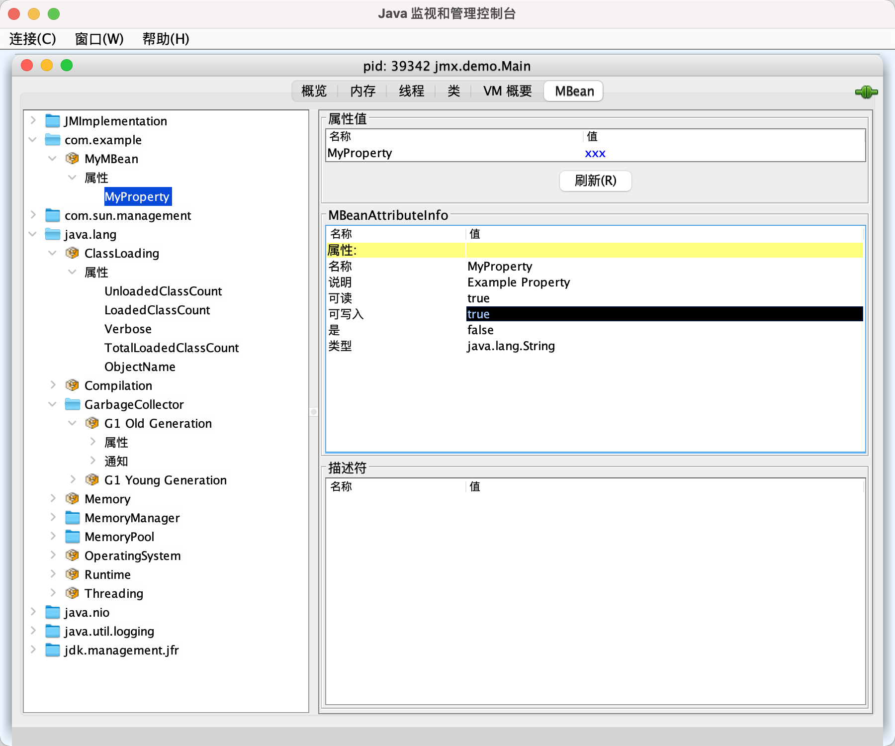

### JMX Agent
- **概念简述：**
  JMX Agent是一种用于监控和管理Java应用程序资源的工具，通过Java Management Extensions (JMX) 提供标准化接口。

- **启用远程JMX服务方法：**

  方法一：
  使用Java命令行参数启动应用时配置JMX远程访问。如下示例所示，通过指定一系列`-Dcom.sun.management.jmxremote.*` 参数，JVM将自动开启并配置一个监听在特定端口上的JMX远程连接器服务器。

  ```sh
  java -cp target/java-sec-1.0-SNAPSHOT.jar \
    -Dcom.sun.management.jmxremote.port=9010 \
    -Dcom.sun.management.jmxremote.local.only=false \
    -Dcom.sun.management.jmxremote.authenticate=false \
    -Dcom.sun.management.jmxremote.ssl=false \
    jmx.demo.Main
  ```

  参考文档：[Oracle官方指南](https://docs.oracle.com/javadb/10.10.1.2/adminguide/radminjmxenablenoauth.html)

  > tomcat等容器的jmx监控也可以通过参数配置实现

  方法二：
  在代码中手动创建并启动`JMXConnectorServer`实例。下面的代码片段展示了如何通过自定义配置创建一个JMX连接器服务器：

  ```java
  JMXServiceURL jmxServiceURL = new JMXServiceURL("service:jmx:rmi:///jndi/rmi://localhost:1099/jmxrmi");
  MBeanServer mBeanServer = ManagementFactory.getPlatformMBeanServer();
  JMXConnectorServer jmxConnectorServer = JMXConnectorServerFactory.newJMXConnectorServer(jmxServiceURL, null, mBeanServer);
  jmxConnectorServer.start();
  System.out.println("JMXConnectorServer is running");
  ```

  参考代码：[Main.java](https://github.com/leveryd-kb/java-sec-code/blob/master/src/main/java/jmx/demo/Main.java)

  完成上述任一方法以打开JMX服务后，即可利用如JConsole这样的客户端工具连接到该服务，并对MBean进行管理和监控操作。

  


### MBean和MBean服务器
- **概念解析：**
  MBean（Managed Bean）是指实现了如 `DynamicMBean` 等JMX规范接口的类，一旦此类实例被注册到MBean服务器中，其代表的应用组件就可以通过Java Management Extensions (JMX) 进行管理和监控。

- **应用与范围：**
  MBean的作用域限定在应用程序层面，而非操作系统级别。这意味着MBean反映的是运行于特定Java虚拟机（JVM）中的应用服务、资源或配置信息的状态和操作接口。

- **参考实现：**
  您可以查阅[MyMBean.java](https://github.com/leveryd-kb/java-sec-code/blob/master/src/main/java/jmx/demo/MyMBean.java)以获得具体实现细节：

  在实践中，开发人员会创建符合MBean规范的类，并将其实例注册至MBean服务器，从而使得这些类能够通过JMX工具或API进行查询、控制和管理。

### Jolokia 和 JMX 是什么关系

Jolokia 是一个基于HTTP/JSON的代理，它扩展了Java Management Extensions (JMX) 的功能，使得非Java客户端也能方便地远程访问和管理JMX MBeans。

**怎么使用Jolokia**

* 对于Spring Boot应用，可以添加Jolokia starter依赖，并在配置文件中开启相关端点。
* 对于独立Java应用程序，可以直接将Jolokia代理（agent）嵌入到应用程序中。

```
java -javaagent:path/to/jolokia-jvm-agent.jar=port=8778 -jar your-application.jar
```

**查询所有MBean信息** 一旦Jolokia代理启动并监听指定端口，你可以通过发送HTTP请求获取所有MBean列表：

```
http://localhost:8778/jolokia/list
```

### 哪些工具用来做应用监控？

* jolokia
* jconsole
* jboss jmx-console
* hawtio


# 总结

工具的依赖关系如下
```
  JConsole  hawtio
       ▲      ▲
       │      │
JMX Server  Jolokia
       ▲      ▲
       │      │
     MBean Server
           ▲
           │
         MBean
```

# 疑问
* JConsole连接本地进程是怎么实现的？
