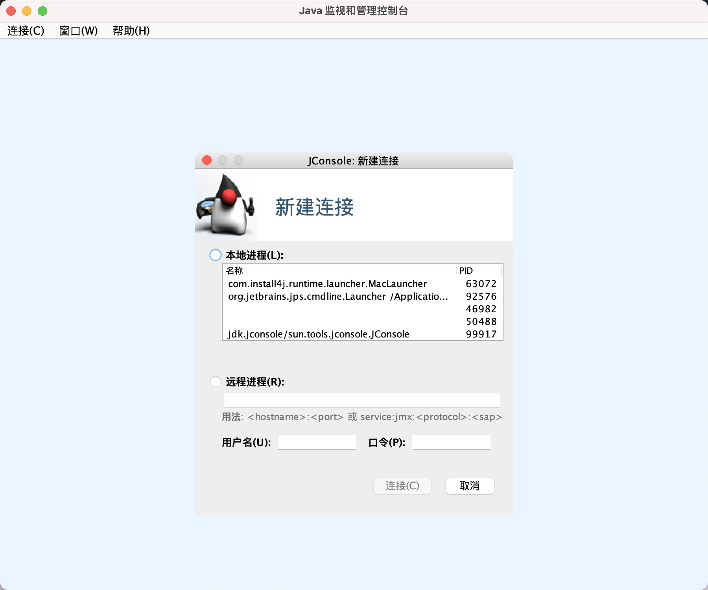

# 背景

JConsole可以根据pid管理本地进程的MBean，如下图

它是怎么做到的呢？

# gpt的答案
gpt 回答
No, the `javax.management.remote.JMXConnector` class does not directly connect to a JVM using a process ID (PID). Instead, it connects to a JVM's MBean server using a `JMXServiceURL`, which specifies the protocol for the connection, the host and port number of the remote JVM, and other information.

However, when using tools like `jconsole` to connect to a local JVM, there is a special mechanism in place to simplify this process. The `com.sun.tools.attach` package, which is part of the JDK, provides a way to "attach" to a running JVM given its PID. This package is used by tools like `jconsole` and `VisualVM` to discover local JVM processes and connect to them.

Here's a simplified description of how this works:

1. When a JVM starts, it creates a file in a temporary directory. This file is named with the PID of the JVM and contains the address of the JVM's local JMX agent.

2. When a tool like `jconsole` wants to connect to a local JVM, it uses the `com.sun.tools.attach.VirtualMachine` class to "attach" to the JVM given its PID. This involves reading the JVM's temporary file to get the address of the local JMX agent.

3. The tool then creates a `JMXServiceURL` using the address of the local JMX agent, and uses this URL to create a `JMXConnector` and connect to the JVM's MBean server.

4. Once the connection is established, the tool can interact with the JVM's MBeans using the `MBeanServerConnection` obtained from the `JMXConnector`.

Please note that this mechanism for connecting to a local JVM is specific to the Oracle and OpenJDK JVMs, and may not be available or work the same way in other JVMs. Also, it requires the appropriate file system permissions to read the JVM's temporary file.

# `com.sun.tools.attach.VirtualMachine` 类是什么？ 和 java agent有关系吗？

attach后会加载agent

# attach机制可以用来提权吗？

# jconsole 打开的jmx服务，带有鉴权吗？

如果不鉴权，任意本地进程都可以连接jmx服务，可能提权？

> java17测试

TODO: 待研究